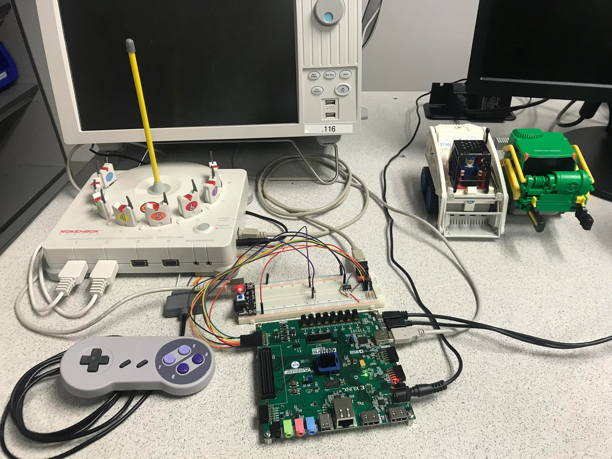
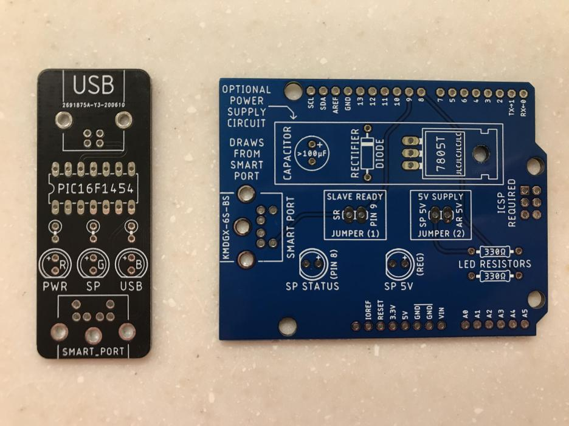
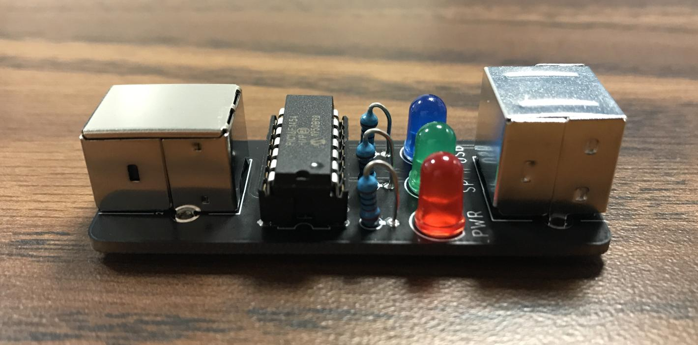

# Stepstools Electronics Projects

### The Original Project Implemented on FPGA

### Custom PCBs For Project

### USB Smart Port Interface

### Arduino Smart Port Shield

### Software to Control USB Interface Using Mouse

### Software to Control USB Interface Using X-Input Controller

### Minimal X-Input Control Overlay
